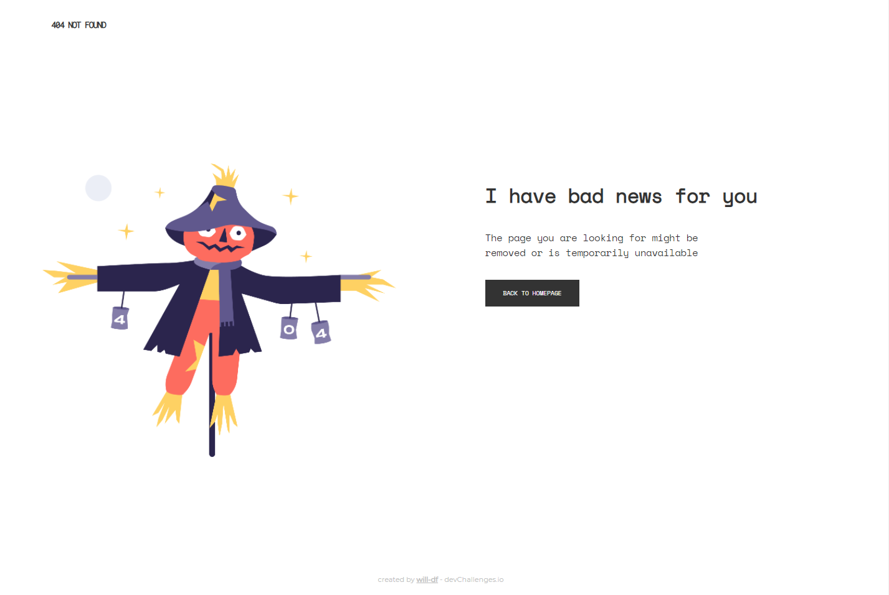
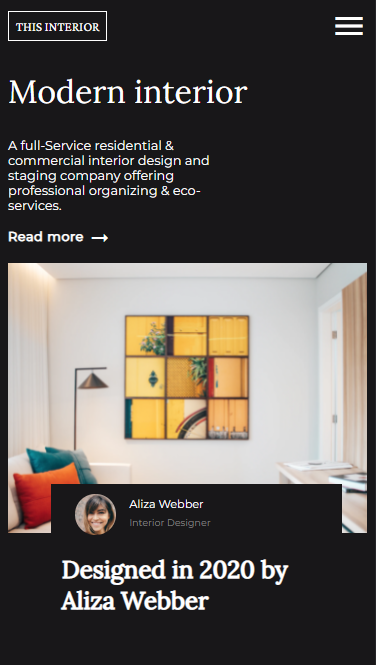
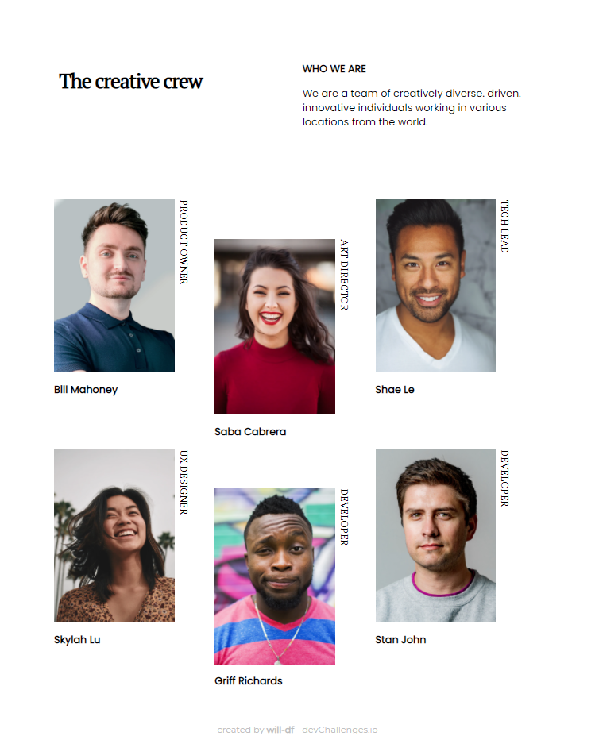
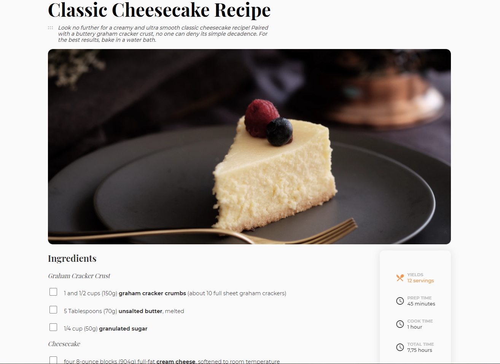
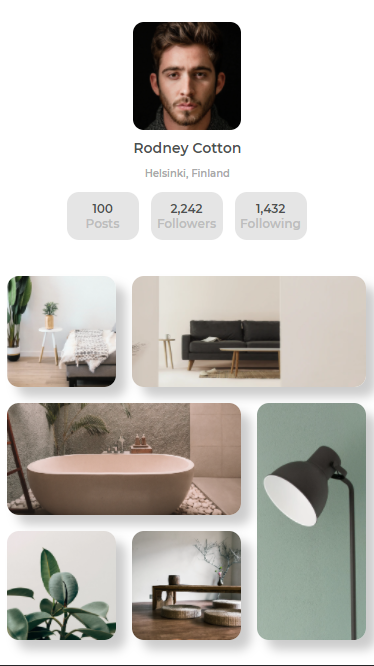

<h1 align="center">Dev challenges</h1>

   This repo gathers all the code for the solutions I submitted to <a href="http://devchallenges.io" target="_blank">Devchallenges.io</a>

  <h3>
    <a href="https://will-df.github.io/devchallenges/index.html">
      Demo index
    </a>
     | 
    <a href="https://github.com/will-df/devchallenges">
      Solutions
    </a>
     | 
    <a href="https://devchallenges.io">
      Dev Challenges website
    </a>
  </h3>

<!-- TABLE OF CONTENTS -->

## Table of Contents

- [Overview](#overview)
- [404 page](#404-page)
  - [Built With](#built-with)
  - [Features](#features)
- [Interior Design](#interior-design)
  - [Built With](#built-with-1)
  - [Features](#features-1)
- [Team Page](#team-page)
  - [Built With](#built-with-2)
  - [Features](#features-2)
- [Recipe Page](#recipe-page)
  - [Built With](#built-with-3)
  - [Features](#features-3)
- [Acknowledgements](#acknowledgements)
- [Contact](#contact)

<!-- OVERVIEW -->

## Overview

I started coding solutions to the challenges on [Devchallenges.io](http://devchallenges.io) and the different repositories were cluttering my github. That's why I decided to move to a unique repository. Below I write about each dev challenges individually

## 404 page

The [challenge](https://devchallenges.io/challenges/wBunSb7FPrIepJZAg0sY) was to create a responsive 404 page. I did it completely by hand, no css generator used.

I learnt to use the flexbox in this experience to make the page responsive and change layout under 600px of width. Also, it's the first time that I used google fonts and learnt that you need to link them before invoking them in your css.

### Built With

- HTML 5
- CSS

### Features

- The page changes layout when the screen width is below/above 600px

## Interior Design

The [challenge](https://devchallenges.io/challenges/Jymh2b2FyebRTUljkNcb) was to create an interior design responsive page with a navigator menu. I did it completely by hand, no css generator used.

It was an interesting experience to create a full screen menu in the mobile version. I made it with a small drop down animation.
First usage of material icons too, very powerful palette.

### Built With

- HTML 5
- CSS
- Plain old javascript

### Features

- The page changes layout when the screen width is below/above 600px
- Under 600 px of screen width, the menu is substituted by an hamburger button that opens a full screen overlay with the navigation links

## Team Page

The [challenge](https://devchallenges.io/challenges/hhmesazsqgKXrTkYkt0U) was to create a responsive team page. I did it completely by hand, no css generator used.

I wanted to use the grid display because I wanted to get some experience with it and I must say it did well the job. Playing with media selectors and position CSS attributes allowed for easy configuration of the member mugshots to be moved down.

### Built With

- HTML 5
- CSS

### Features

- The page changes layout when the screen width is below/above 600px
- Under 600 px of screen width, images become 2 per row

## Recipe Page

The [challenge](https://devchallenges.io/challenges/TtUjDt19eIHxNQ4n5jps) was to create a responsive recipe page. This time I started using Sass to organize better my css files. I wrote the html and sass files by hand

It's been a relatively long page to build, I had to experiment a lot with css for the small info box with cooking time, number of portions etc.
Also for the first time I did a custom numbered list (you'll find a good article on how to in the Acknowledgements section).

### Built With

- HTML 5
- CSS
- [Sass](https://sass-lang.com/)

### Features

- The page changes layout when the screen width is below/above 992px
- The info box with cooking time, number of portions etc. sticks when scrolling down in the desktop layout

## Gallery Master

The [challenge](https://devchallenges.io/challenges/gcbWLxG6wdennelX7b8I) was to create an image gallery page.

I adopted the usage of em units for all absolute mesures to allow for fast creation of the desktop version (mobile was done first!).
The image gallery itself has been done with the usage of the grid display.

### Built With

- HTML 5
- CSS
- [Sass](https://sass-lang.com/)

### Features

- The page changes layout when the screen width is below/above 1024px
- All sizes have been defined in em units

## Acknowledgements

- [W3Schools](https://www.w3schools.com/)
- [Chris Coyier](https://css-tricks.com/custom-list-number-styling/) for the interesting article on how to create custom ordered lists

## Contact

- GitHub [@will-df](https://github.com/will-df)
- LinkedIn [William De Filippo](https://www.linkedin.com/in/williamdefilippo/)
